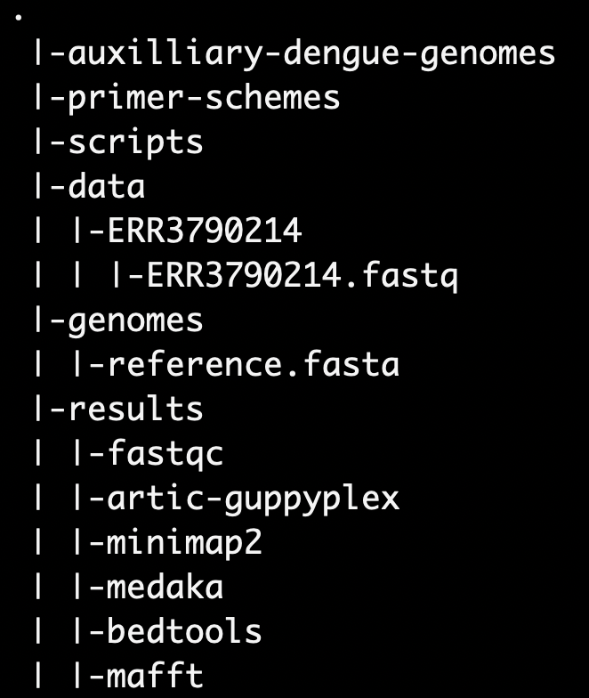

# **Implementing a typical artic workflow**
---
###### ***Trainers***: [John Juma](https://github.com/ajodeh-juma), [Gilbert Kibet](https://github.com/kibet-gilbert) & [Kennedy Mwangi](https://github.com/ousodaniel)
---

- [Introduction](#introduction)
- [Task](#task)
- [Workflow](#workflow)
- [Auxilliary data](#auxilliary-data)
- [Instructions](#instructions)

## Introduction
Dengue is a mosquito-borne viral disease that has rapidly spread to all regions of WHO in recent years. Dengue virus is transmitted by female mosquitoes mainly
of the species *Aedes aegypti* and, to a lesser extent, *Ae. albopictus*. These
mosquitoes are also vectors of chikungunya, yellow fever and Zika viruses.

Dengue is widespread throughout the tropics, with local variations in risk
influenced by climate parameters as well as social and environmental factors.
Dengue is caused by a virus of the Flaviviridae family and there are four
distinct, but closely related, serotypes of the virus that cause dengue (DENV-1,
DENV-2, DENV-3 and DENV-4). 

## Task

In this exercise, you are required to perform analysis of Oxford
Nanopore Technology amplicon sequencing derived data of Dengue isolate(s).

## Workflow

The major steps of the pipeline can be presented as shown in the figure below

## Auxilliary data

The following auxilliary files are provided and you will need to create
`symbolic` links 

- Primer scheme for amplicon in `bed` format located at
  `/var/scratch/global/ont-artic/primer-schemes/primer.bed`
- Reference genome file in `fasta` format located at
  `/var/scratch/global/ont-artic/primer-schemes/reference.fasta`
- Additional Dengue virus genomes in `fasta` format located at
  `/var/scratch/global/ont-artic/auxilliary-dengue-genomes`
- Utility scripts available at `/var/scratch/global/ont-artic/scripts`
- model used was `r941_min_high_g360`

## Instructions

>**Note**
Please document all the steps in the analysis and replicate the commands in a
`text` file.

Ensure you are working in the `/var/scratch/$USER/` directory

1. Login to the `hpc` using your provided credentials
2. Begin an `interactive` session with 2 `cpus` on either `compute05` or
   `compute06`
3. Create `soft` or `symbolic` links to the required directories or files
4. Organize your project directory structure as indicated below. 

    
5. Load all the required modules that will be utilized in the analysis steps
6. The raw data in `fastq` format can be retrieved from the European Nucleotide
   Archive [(ENA)](https://www.ebi.ac.uk/ena/browser/) database. 

   Apply the appropriate tool to retrieve the raw reads for the accession
   `ERR3790214`
   
   Output the `.fastq` in a sub-directory named using the accession number
   i.e `data/ERR3790214/`

   

      
Hint

    `fasterq-dump`
     
    

 
7. For use in variant calling and visualization of alignment, please create the
   genome index of the reference genome

   >**<strong style="color:magenta;opacity: 0.80;">Quiz:</strong>**

    - What does the above step perform?
    - What is the size of the genome in base pairs?

8. Perform a quality assessment of the raw reads in `fastq` format and output
    the files in the appropriate directory.

    >**<strong style="color:magenta;opacity: 0.80;">Quiz:</strong>**
    - How many modules have passed the quality check?
    - Report the total number of sequences? sequences flagged as poor quality? sequence
    lengths distribution? and percetage GC content?

9. Perform a preprocessing step to only select viable reads for subsequent
    downstream steps. Be guided by the primer scheme and the quality assessment
    report to select the optimal read lengths
    
    >**<strong style="color:magenta;opacity: 0.80;">Quiz:</strong>**

    - How many primer pools are in the scheme?
    - What is the total number of primers in the scheme?
    - Why did you choose the values for read lengths in this step?

    Following the size filtering procedure, 

    - How many reads pass the filtering process when using your selected
      amplicon lengths?

10. Perform reference based read alignment to the reference genome and output
    the alignment files in the appropriate directory. Carry out the steps that
    will:
    - The `FLAG` column in the alignment format allows us to identify the
      mapped or unmapped reads. Extract reads that align to the reference genome
    - Sort the resulting mapped alignment
    - Index the alignment according to `coordinate`
    - Generate statistics on the resulting alignment

    >**<strong style="color:magenta;opacity: 0.80 ">Quiz:</strong>**
    - What is the percentage of mapped reads?

11. Perform a post-alignment process to assign each raed to its derived
    amplicon, normalise the amplicons and remove incorrect primer-pairs. Output
    the results in the appropriate directory. After every post-processing step,
    sort and index the resulting alignments while naming the files with the
    prefixes
    `.trimmed.rg` and `primertrimmed.rg` as appropriate

    - normalise to only retain retain amplicons with 200 reads

    >**<strong style="color:magenta;opacity: 0.80 ">Quiz:</strong>**

    - What is the number of reads assigned to every primer pool?
    - What is the mapping rate of the primer trimmed alignments?

12. For each primer pool, perform variant calling to while using the given model
    and output the results in the relevant output directory. 
    
    - Ensure you follow all the steps including `INDELS` identification before
      finally merging the variants from the separate primer pools. 
    - Compress the merged variant call format file and index it. 
    - Annotate the variants using `longshot`
    - Filter the merged variant file and assign all variants as either PASS or
      FAIL. 
    - Index the variants that PASS file after compression
    
13. Compute depths for each primer pool and mask low depth regions to generate a
    preconsensus file
    >**<strong style="color:magenta;opacity: 0.80 ">Quiz:</strong>**
    - What is the highest depth for each primer pool?

14. Generate consensus sequence and rename the header of the resulting consensus
    file

    >**<strong style="color:magenta;opacity: 0.80 ">Quiz:</strong>**
    - What is the coverage of the resulting consensus sequence?

15. Compute non-normalized read depth per position and plot the output using the
    utility Rscript provided

16. In the alignment directoty, concatenate the reference genome file, the
    `auxilliary-dengue-genomes` `fasta` files and the generated consensus sequence
    into a single `fasta` file
    - Ensure to only retain only the first string character and exclude the rest
      if the characters including the first space in the sequence headers

17. Perform a multiple sequence alignment and generate a maximul likelihood
    phylogenetic tree
    
18. Identify the serotype and genotype of the sample using the typing tool available at
https://www.genomedetective.com/app/typingtool/dengue/

19. Transfer the outputs from the `hpc` to your `local` PC and visualize the
    `.html`, `.bam`, `.pdf` and `treefile` using appropriate tools.